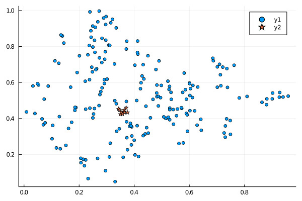
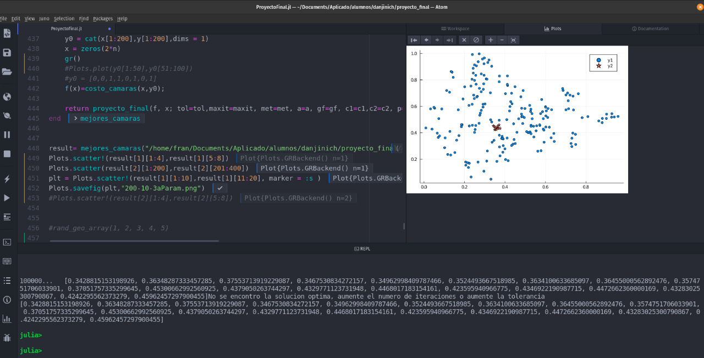
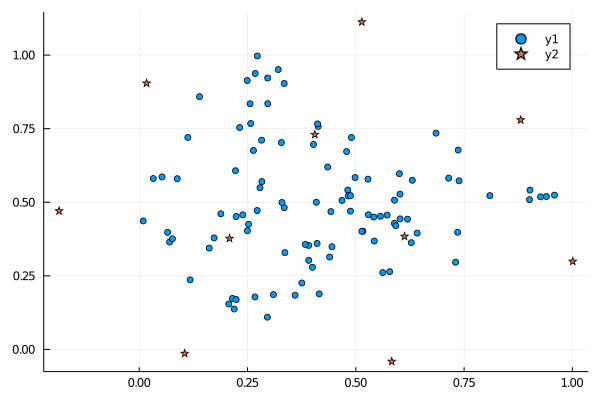
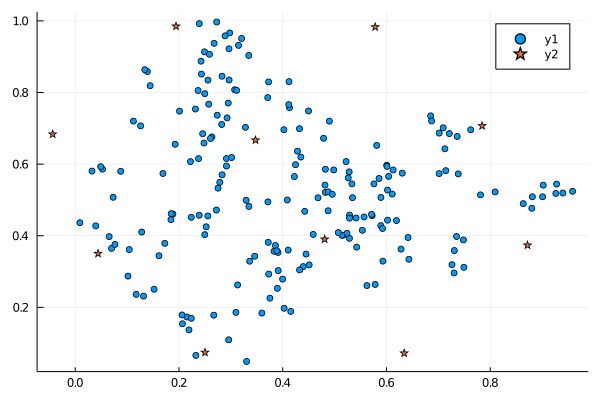
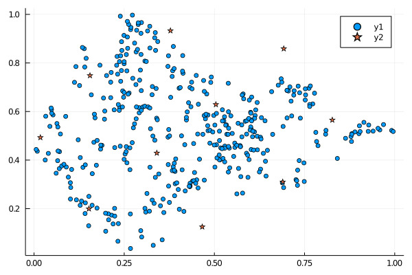

# Proyecto Análisis Aplicado
El proyecto final está escrito en Julia. A continuación se explicarán conceptos básicos de este lenguaje. Posteriormente se explican las funciones de álgebra lineal que utilizamos. Luego vienen las funciones de los 4 métodos: BFGS, Newton, Newton con modificación a la Hessiana y Line Search. Por último se exploran sus usos tanto con la función de Rosenbrock, como con la función propuesta para resolver el problema de las cámaras de seguridad. 

En julia no existen clases pero si structs (muy parecidas a las de c). Usamos structs normales y mutables para crear un “paquete” que podamos llamar desde otros archivos y aprovechar sus métodos de manera eficiente. 

Nuestro código está estructurado de la siguiente forma: se definió una struct general llamada proyecto_final para poder optimizar sobre una funcion dada con un punto inicial dado. Este struct crea una otra struct del tipo abstracto `DescentMethod`, y del tipo especifico dado que se usa para optimizar. Cada struct del tipo `DescentMethod` tiene una función asignada `init!` y `step!`, estas funciones las usa una función que se llama `descenso` para optimizar.

Para poder correrlo hay que seguir las siguientes instrucciones:
1. Correr en la terminal `julia`
  * Se recomienda empezar usando `julia --threads 2` o algún otro número en lugar de `2`. Este programa utiliza varios threads. Mientras más se utilicen, mayor será la velocidad. Esto está acotado por el tamaño de la matriz más grande. Esta es una de las razones y ventajas por las cuales preferimos usar este lenguaje.
2. Dentro de Julia, correr en la terminal: `include("path/to/ProyectoFinal.jl")`, utilizado el path al proyecto.
## Guía básica de Julia
Julia como lenguaje de programación es relativamente sencillo con sintaxis similar a lenguajes como Python, R y Matlab. Una guía de sus diferencias básicas donde están presentadas algunas de las características del lenguaje importantes para este proyecto se pueden ver [aqui](https://docs.julialang.org/en/v1/manual/noteworthy-differences/). Aquí están presentadas algunas de las 
### Tipos
El lenguaje Julia puede ser estricto con los tipos utilizados. Si la función pide un `Float64` es importante pasar algo que el compilador entiende como `Float64`, es decir, si se quiere usar un entero es importante agregar un `.0` después del número.
### Vectores
Los vectores son arreglos unidimensionales que se pueden utilizar como vectores después de importar el paquete `LinearAlgebra`. Al correr este programa se importa el paquete, pero la instrucción para importarlo es: `using LinearAlgebra`. Un vector o arreglo se define como:
```
x=[1.0, 2, 3] #Arreglo de Float64
x=[1, 2, 3] #Arreglo de Int64
x=Array{Float64}(undef, 3) #Arreglo vacío de longitud 3
x=zeros(3) #Arreglo de ceros de longitud 3
```
### Matrices
Funcionan con los mismos principios que el vector, siendo arreglos bidimensionales.
```
x=[1.0 2 3; 4 5 6; 7 8 9] #Arreglo de Float64
x=[1 2 3; 4 5 6; 7 8 9] #Arreglo de Int64
x=Array{Float64}(undef, 3, 3) #Arreglo vacío de tamaño 3x3
x=zeros(3, 3) #Arreglo de ceros de tamaño 3x3
x=Matrix{Float64}(I, 3, 3) #Matriz identidad de 3x3
```
### Funciones
Para definir una función anónima se puede hacer:
```
f(x)=x+1
```
Las funciones tienen dos tipos de parámetros: los obligatorios y los opcionales. Los parámetros obligatorios deben de pasar separados por comas en el mismo orden que en la definición de la función. Si se quiere pasar parámetros opcionales, se pone un `;` después de los parámetros obligatorios y se asignan con nombre al parámetro:
```
f(x;y=1)=x+y
f(5) #Regresa 6
f(5;y=1) #Regresa 6
f(5; y=7) #Regresa 12
```
## Documentación

## Funciones necesarias de álgebra lineal

### is_pos_semi_def
Esta función recibe un arreglo bidimensional de `Float64` y regresa un Booleano que es `true` si la matriz es semidefinida positiva y `false` si no lo es.
#### Ejemplo:
```
julia> is_pos_semi_def([1.0 0 0; 0 1 0; 0 0 1])
true
```
### is_pos_def
Esta función recibe un arreglo bidimensional de `Float64` y regresa un Booleano que es `true` si la matriz es definida positiva y `false` si no lo es.
#### Ejemplo:
```
julia> is_pos_def([1.0 0 0; 0 1 0; 0 0 1])
true
```
### grad
Esta función recibe una función, un arreglo numérico de una dimensión y, opcionalmente, una `h` con valor default `1e-20`. Regresa un arreglo de `Float64` de una dimensión. Para calcularla, se usa un paso complejo, lo que limita las funciones utilizables a todas las funciones que utilizan valores absolutos pero, como ventaja, aumentan significativamente la precisión. El método está basado en [este paper](https://www.researchgate.net/publication/222112601_The_Complex-Step_Derivative_Approximation).
#### Ejemplo:
```
julia> f(x)=x[1]*x[2]
f (generic function with 1 method)

julia> grad(f, [1,3]; h=1e-10)
2-element Array{Float64,1}:
 3.0
 1.0
```

### derivative
Esta función recibe una función, un arreglo numérico de una dimensión y, opcionalmente, una `h` con valor default `1e-20`. Regresa la parte imaginaria de la funcion con paso complejo.

#### Ejemplo:
```
julia> f(x)=x[1]*x[2]
f (generic function with 1 method)

julia> derivative(f, [1,3]; h=1e-20)
2-element Array{Float64,1}:
 0.0
 0.0
```

### hess
Esta función recibe una función, un arreglo numérico de una dimensión y, opcionalmente, una `h` con valor default `1e-7`. Regresa un arreglo de `Float64` de 2 dimensiones. Se calcula a través de un paso complejo y diferencia centrada, lo que limita las funciones utilizables a todas las funciones que utilizan valores absolutos pero, como ventaja, aumenta significativamente la precisión. El metodo esta basado en [este programa en Matlab](https://www.mathworks.com/matlabcentral/fileexchange/18177-complex-step-hessian).
#### Ejemplo:
```
julia> f(x)=(x[1]^2)*(x[2]^2)
f (generic function with 1 method)

julia> hess(f, [1,3]; h=1e-5)
2×2 Array{Float64,2}:
 18.0  12.0
 12.0   2.0
```
### check_optimality
Esta función recibe un gradiente, una hessiana y, opcionalmente, recibe una tolerancia `tol` con valor default `1e-20`. Regresa un booleano que es `true` si es óptimo y `false` si no lo es.
#### Ejemplo:
```
julia> f(x)=x[1]^2+x[2]^2
f (generic function with 1 method)

julia> x=[0.0, 0]
2-element Array{Float64,1}:
 0.0
 0.0

julia> check_optimality(grad(f,x),hess(f,x);tol=0.0)
true
```
### backtracking_line_search
Es el algoritmo 3.1 del Nocedal.  Recibe una función, un arreglo numérico, otro arreglo numérico y, opcionalmente, recibe tres variables `Float64`: una `a` con valor default `1`, una `c` con valor default `1e-4` y una `p` (rho) con valor default `0.5`. Regresa un `Float64`.

### add_identity
Busca iterativamente un número `t` tal que la matriz A+I*t sea definida positiva y regresa la matriz A+I*t. Recibe una matriz de `Float64` y, opcionalmente, un `Float64` `b` con default `1e-4`. Regresa una matriz definida positiva.

### line_search_newton_modification
Es el algoritmo 3.2 del Nocedal. Recibe una función, un punto inicial y, opcionalmente, recibe una tolerancia `tol` con valor default `1e-4` y un máximo de iteraciones `maxit` con valor default `10000`. Regresa las coordenadas de la mejor aproximación que se logró e imprime el número de iteraciones.
#### Ejemplo
```
julia> f(x)=x[1]^2+x[2]^2
f (generic function with 1 method)

julia> x=[10.0, 100]
2-element Array{Float64,1}:
  10.0
 100.0

julia> line_search_newton_modification(f,x;tol=0.0,maxit=1000000)
Numero de iteraciones:    4
2-element Array{Float64,1}:
 0.0
 0.0
```
### rosenbrock
Es la función de Rosenbrock. Recibe un arreglo numérico y, opcionalmente, números: `a` con valor default `1` y `b`. Regresa el resultado de la función de Rosenbrock.
#### Ejemplo
```
julia> rosenbrock([1,2]; a=2, b=200)
201
```
## Declaracion de tipos de descenso

### BFGS
Se realiza una estructura con el método de Broyden–Fletcher–Goldfarb–Shanno. Se recibe `Q` y `c1`, `c2` y `p` (rho) valores para las condiciones de Wolfe.

#### init!
Función que inicializa a `D` para el método a partir de Q. Recibe `D`, `x` y el gradiente de f `gf`. Regresa `D`

#### step!
Función que calcula el paso para el método de BFGS. Recibe `D`, `f`, el gradiente de f, `x`, el gradiente de `f` evaluado en `x` y la hessiana ´hx´. Regresa el valor de `x` en el siguiente paso `xk` y su valor `gk`.

#### Ejemplo

```
julia> revisar([rand(1:10),rand(1:100)], rand(1:10), rand(1:1000); tol=1e-10, maxit=10000, met="BFGS")
El minimo real es:      f([5,25])=0
Se encontro la solucion optima en 337 iteraciones
El minimo que se encontro es:   f([5.000000000003951,25.000000000039496])=1.5648387652266782e-23


El error absoluto en x es:  3.950617610826157e-12
El error relativo en x es:  7.901235221652314e-13

El error absoluto en y es:  3.949551796722517e-11
El error relativo en y es:  1.5798207186890068e-12
proyecto_final(var"#f#31"{Int64,Int64}(5, 361), var"#6#8"{var"#f#31"{Int64,Int64}}(var"#f#31"{Int64,Int64}(5, 361)), [9.0, 74.0], 1.0e-10, 10000, "BFGS", [5.000000000003951, 25.000000000039496], Union{Nothing, Array{Float64,1}}[[9.0, 74.0], [8.28921875, 74.039484375], [6.374974385521797, 39.77788101766573], [6.409142553328667, 40.34803078058789], [6.42956326343071, 40.69312589259679], [6.447462954608365, 40.99902770387539], [6.462979572531998, 41.266967092746555], [6.476407835392167, 41.501067268665004], [6.488015119466908, 41.70519950936333], [6.498041236044906, 41.88294250642476]  …  nothing, nothing, nothing, nothing, nothing, nothing, nothing, nothing, nothing, nothing])

```

### Metodo de Newton
Se realiza una estructura con el método de Newton.

#### init!
Función que inicializa a D para el método a partir de Q. Recibe `D`, `x` y el gradiente de f `gf`. Regresa `D`

#### step!
Función que calcula el paso para el método de BFGS. Recibe `D`, `f`, el gradiente de f, `x`, el gradiente de `x` y la matriz Hessiana `Hx`. Regresa el valor de `x` en el siguiente paso `xk` y su valor `gk`.

#### Ejemplo 

```
julia> revisar([rand(1:10),rand(1:100)], rand(1:10), rand(1:1000); tol=1e-10, maxit=10000, met="NEWT")
El minimo real es:      f([2,4])=0
Se encontro la solucion optima en 6 iteraciones
El minimo que se encontro es:   f([1.9999999999998324,3.999999999999329])=2.82789378189431e-26


El error absoluto en x es:  1.6764367671839864e-13
El error relativo en x es:  8.382183835919932e-14

El error absoluto en y es:  6.710187960834446e-13
El error relativo en y es:  1.6775469902086115e-13
proyecto_final(var"#f#31"{Int64,Int64}(2, 885), var"#6#8"{var"#f#31"{Int64,Int64}}(var"#f#31"{Int64,Int64}(2, 885)), [6.0, 46.0], 1.0e-10, 10000, "NEWT", [1.9999999999998324, 3.999999999999329], Union{Nothing, Array{Float64,1}}[[6.0, 46.0], [6.0002260259534195, 36.00271236950106], [1.9967328348701612, -12.041015717203457], [1.9967329545860868, 3.9869425952459174], [2.00000049760486, 3.9999913135823086], [2.000000009228558, 4.0000000369140105], [1.9999999999998324, 3.999999999999329], nothing, nothing, nothing  …  nothing, nothing, nothing, nothing, nothing, nothing, nothing, nothing, nothing, nothing])
```

### Metodo de Newton con modificacion a la Hessiana
Se realiza una estructura con el método de Newton con modificación a la Hessiana donde recibe el valor del parámetro `a`.

#### init!
Función que inicializa a `D` para el método a partir de `Q`. Recibe `D`, `x` y el gradiente de f `gf`. Regresa `D.`

#### step!
Función que calcula el paso para el método de BFGS. Recibe `D`, `f`, el gradiente de f, `x`, el gradiente de `f` evaluado en `x` y la matriz Hessiana `Hx`. Regresa el valor de `x` en el siguiente paso `xk` y su valor `gk`.

#### Ejemplo 

```
julia> revisar([rand(1:10),rand(1:100)], rand(1:10), rand(1:1000); tol=1e-10, maxit=10000, met="NEWT-H")
El minimo real es:      f([4,16])=0
Se encontro la solucion optima en 1238 iteraciones
El minimo que se encontro es:   f([4.000000000005225,16.00000000004179])=2.73522128209125e-23


El error absoluto en x es:  5.225153643095837e-12
El error relativo en x es:  1.3062884107739592e-12

El error absoluto en y es:  4.179057100373029e-11
El error relativo en y es:  2.6119106877331433e-12
proyecto_final(var"#f#31"{Int64,Int64}(4, 440), var"#6#8"{var"#f#31"{Int64,Int64}}(var"#f#31"{Int64,Int64}(4, 440)), [9.0, 67.0], 1.0e-10, 10000, "NEWT-H", [4.000000000005225, 16.00000000004179], Union{Nothing, Array{Float64,1}}[[9.0, 67.0], [8.999594225949398, 80.9926969164393], [8.844357355329226, 78.19855920606642], [8.837542183474046, 78.07876063241565], [8.83054078799992, 77.95574135215504], [8.823349415584259, 77.82944360158183], [8.815965293211574, 77.69982732135534], [8.808385006782252, 77.56684151005564], [8.800605708188941, 77.43044554958428], [8.792624541589833, 77.29059907650502]  …  nothing, nothing, nothing, nothing, nothing, nothing, nothing, nothing, nothing, nothing])
```

### Line Search
Se realiza una estructura con el método de Newton.

#### init!
Función que inicializa a `D` para el método a partir de `Q`. Recibe `D`, `x` y el gradiente de `f`: `gf`. Regresa `D`

#### step!
Función que calcula el paso para el método de BFGS. Recibe `D`, `f`, el gradiente de `f`, `x`, el gradiente de `f` evaluado en `x` y la matriz Hessiana `Hx`. Regresa el valor de `x` en el siguiente paso `xk` y su valor `gk`.

#### interpolate
Función que interpola. Recibe los puntos `a1`, `a2` y la función `f`. Regresa un punto entre `a1` y `a2`.

#### zoom
Función que calcula la `ak` óptima para el método. Recibe los puntos `al`, `ah`, la funcion `f`, y valores para `c1` y `c2`. Regresa el valor de `a` = `ak` que se usará.

#### minimize
Función que minimiza la alpha. Recibe la funcion `f`, los valores `c1`, `c2` y `p` inicializados en `1e-3`, `0.9` y `2` respectivamente. Regresa la alpha minimizada.

#### line_step_size
Funcion que calcula el tamaño del paso para el método de line search. Recibe la función `f`, `x` & `d`. Regresa `x` más el tamaño del paso.

#### Ejemplo 

```
julia> revisar([rand(1:10),rand(1:100)], rand(1:10), rand(1:1000); tol=1e-10, maxit=10000, met="LINE") 
El minimo real es:      f([9,81])=0
10000...    [8.718937208627121, 76.01980445261097]No se encontro la solucion optima, aumente el numero de iteraciones o aumente la tolerancia
El minimo que se encontro es:   f([8.718937208627121,76.01980445261097])=0.07899736259943636


El error absoluto en x es:  0.2810627913728787
El error relativo en x es:  0.03122919904143097

El error absoluto en y es:  4.98019554738903
El error relativo en y es:  0.06148389564677815
proyecto_final(var"#f#31"{Int64,Int64}(9, 282), var"#6#8"{var"#f#31"{Int64,Int64}}(var"#f#31"{Int64,Int64}(9, 282)), [9.0, 76.0], 1.0e-10, 10000, "LINE", [8.718937208627121, 76.01980445261097], Union{Nothing, Array{Float64,1}}[[9.0, 76.0], [8.6034375, 76.02203125], [8.755298731793536, 76.01320599640198], [8.70576450921374, 76.01603502871455], [8.723084658294283, 76.01504054100283], [8.71715711116878, 76.01538055111165], [8.719201288415666, 76.01526355437747], [8.71849818625308, 76.01530412516021], [8.718740263897097, 76.0152904944194], [8.718656968445341, 76.01529552324997]  …  [8.718936184772552, 76.01980048183144], [8.718936910389907, 76.01980069206378], [8.718936449471187, 76.01980122218232], [8.718936877313183, 76.01980144949079], [8.718936365538802, 76.01980248621234], [8.718937002961482, 76.01980270150217], [8.718936602768645, 76.01980322813813], [8.71893735591428, 76.01980368863497], [8.718936758755275, 76.01980397472275], [8.718937208627121, 76.01980445261097]])


```

### Funcion general de descenso
Funcion que calcula en general el descenso y genera banderas para saber si encontró o no la solución óptima. Regresa el valor de `x` & el numero de pasos.

## Funciones para optimizar

### revisar
Esta función sirve para demostrar el funcionamiento del código usando la función de Rosenbrock. Recibe un punto inicial, un valor de `a`, un valor de `b`, el método a utilizar y, opcionalmente, recibe una tolerancia `tol` con valor default `1e-10` y un máximo de iteraciones `maxit` con valor default `10000`. Imprime un reporte con el resultado exacto, el número de iteraciones, el resultado obtenido y los errores absolutos y relativos en x & y.

#### Ejemplo

```
julia> revisar([rand(1:10),rand(1:100)], rand(1:10), rand(1:1000); tol=1e-10, maxit=10000, met="NEWT-H")
El minimo real es:      f([4,16])=0
Se encontro la solucion optima en 1238 iteraciones
El minimo que se encontro es:   f([4.000000000005225,16.00000000004179])=2.73522128209125e-23


El error absoluto en x es:  5.225153643095837e-12
El error relativo en x es:  1.3062884107739592e-12

El error absoluto en y es:  4.179057100373029e-11
El error relativo en y es:  2.6119106877331433e-12
proyecto_final(var"#f#31"{Int64,Int64}(4, 440), var"#6#8"{var"#f#31"{Int64,Int64}}(var"#f#31"{Int64,Int64}(4, 440)), [9.0, 67.0], 1.0e-10, 10000, "NEWT-H", [4.000000000005225, 16.00000000004179], Union{Nothing, Array{Float64,1}}[[9.0, 67.0], [8.999594225949398, 80.9926969164393], [8.844357355329226, 78.19855920606642], [8.837542183474046, 78.07876063241565], [8.83054078799992, 77.95574135215504], [8.823349415584259, 77.82944360158183], [8.815965293211574, 77.69982732135534], [8.808385006782252, 77.56684151005564], [8.800605708188941, 77.43044554958428], [8.792624541589833, 77.29059907650502]  …  nothing, nothing, nothing, nothing, nothing, nothing, nothing, nothing, nothing, nothing])


```
## Función de las cámaras

### costo_camara
Esta función es la función de costo que calcula la distancia del punto de la localización de las cámaras al punto del delito. Recibe las coordenadas latitud `lat`y longitud `lon` de donde se pondrían las cámaras, `x0`, los datos descargados de las coordenadas de los delitos cometidos `df` y un valor para `j`. 

### costo_est
Esta función es la función de costo estimado para un número fijo de 20 cámaras. Recibe `x0` y los datos descargados de las coordenadas de los delitos cometidos. Imprime un reporte con los  

### costo
Esta función es la función de costo estimado. Recibe `x0` y los datos descargados de las coordenadas de los delitos cometidos. Imprime un reporte con los  

### rand_geo_array
Esta función genera un intervalo aleatorio de dimensión 1. Recibe los valores `mina` y `maxa` los valores mínimos y máximos de latitud, `mino` y `maxo` los valores máximos de longitud y un valor para `s`. Regresa un intervalo aleatorio dentro de la región donde se encuentran los datos.


### mejores_camaras
Esta función es la función de 

### proyecto_final
Se define una estructura con las siguientes variables necesarias:
`f`: la funcion a minimizar
`gf`: la derivada de f
`x0`: el valoralor inicial
`tol`: la tolerancia
`maxit`: el maximo numero de iteraciones
`met`: el metodo que se va a usar para minimizar
`res`: el valor minimizado
`pasos`: el número de puntos por los que paso el algoritmo
Y el contructor sería la funcion que calcula según el método indicado y usa las variables anteriores y las condiciones de Wolfe `c1`, `c2` y `p` inicializadas en `1e-2`, `0.9` y `2` respectivamente. Regresa la respuesta según el método utilizado usando la función de descenso correspondiente.


## Resultados Finales
Para mostrar los resultados finales, se adjuntan las imágenes con los distintos valores con los que acotamos el problema, ya sea por número de cámaras, crímenes o ambos.

### Prueba inicial
Para la prueba incial se usó el algoritmo para 10 cámaras tomando como datos 200 crímenes y se obtuvo lo siguiente:



Donde el ambiente de ejecución se muestra como sigue:



No obstante, notamos que no tiene mucho sentido que estén las cámaras muy juntas, por lo que se determinó una distancia mínima entre las cámaras de la siguiente forma:

```
for j in 1:m
   for i in 1:m
      if i!=j
         c = ((x[j]-x[i])^2+(x[j+m]-x[i+m]^2)
         if real(c) < 1e-16
            res += 1000
         else
            res += 1/real(c)
         end
      end
   end
end
```

Una vez usada la cota, se muestran los siguientes ejemplos:

### 10 cámaras tomando datos de 100 crímenes



### 10 cámaras tomando datos de 200 crímenes



### 4 cámaras tomando datos de 400 crímenes


### 10 cámaras tomando datos de 400 crímenes

En un primer intento, notamos que las cámaras se iban a las afueras de la zona delimitada de los crímenes por lo que se ajustó la cota mínima en la función de costo para mejorar la optimización de la localización de las cámaras para que se situaran dentro de la región y no se perdiera mucho tiempo en correr el algoritmo. Con dicha modificación se obtuvo lo siguiente:




### Integrantes
* Dan Jinich
* María José Sedano
* Oscar Aguilar
* Francisco Aramburu


